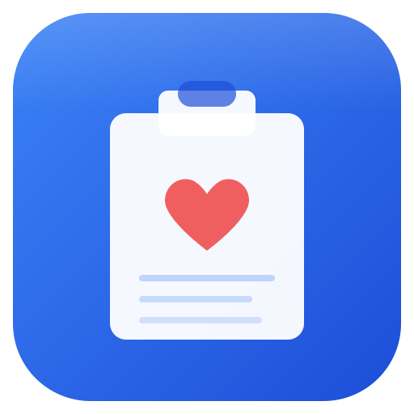

<p align="center">
  
</p>

<h1 align="center">EHR Buddy</h1>

<p align="center">Minimal local EHR for solo mental health practice.<br/>No cloud, no accounts, no subscriptions — just a desktop app that stores everything on your machine.</p>

## What it does

- **Client records** -- name, contact info, diagnosis, insurance details
- **Session notes** -- DAP format or free-text, with CPT codes and fees
- **Clinician profile** -- your credentials, NPI, tax ID, and default fee schedule
- **Superbill PDFs** -- one-click generation for client reimbursement
- **Income reports** -- filterable by date range, exported as PDF or CSV
- **Tax CSV export** -- yearly totals formatted for your accountant
- **One-click backup** -- copies the database to a location you choose

There is no cloud sync, no user authentication, no payment processing, and no insurance claim submission. The app is designed for a single clinician on a single machine.

---

## For clinicians (installing and using the app)

Download the latest installer from the **Releases** page in the sidebar.

### Windows

1. Download **EHR Buddy Setup x.x.x.exe** from Releases.
2. Run the installer. Choose an install location or accept the default.
3. **SmartScreen warning:** Windows will show a "Windows protected your PC" dialog on first launch because the app is not code-signed. Click **"More info"**, then click **"Run anyway"**. This is normal for v1.
4. Launch EHR Buddy from your Start menu or desktop shortcut.

### macOS

1. Download **EHR Buddy-x.x.x.dmg** from Releases.
2. Open the DMG and drag EHR Buddy to your Applications folder.
3. **Gatekeeper warning:** macOS will block the app on first launch. Right-click (or Control-click) the app and choose **Open**, then click **Open** in the dialog.
4. Launch EHR Buddy from Applications.

### Where is my data?

The database is a single SQLite file:

| OS      | Path                                                    |
|---------|---------------------------------------------------------|
| Windows | `%APPDATA%\EHR Buddy\ehrbuddy.db`                      |
| macOS   | `~/Library/Application Support/ehr-buddy/ehrbuddy.db`   |

**Uninstalling the app does NOT delete this file.** Your patient data is preserved until you manually remove it. See [SECURITY.md](SECURITY.md) for guidance on handling PHI.

### Backups

Use the one-click backup button on the Dashboard. It copies the database file to a folder you select. Store backups on an encrypted drive. See [SECURITY.md](SECURITY.md) for details.

---

## For developers

### Prerequisites

- Node.js 18+ (LTS recommended)
- npm 9+
- On macOS: Xcode Command Line Tools (`xcode-select --install`)
- On Windows: Visual Studio Build Tools (for native module compilation)

### Setup

```bash
git clone <repo-url>
cd ehr_buddy
npm install
```

The `postinstall` script runs `electron-rebuild` to compile `better-sqlite3` for the local Electron version.

### Development

```bash
npm run dev
```

This starts `electron-vite` in dev mode with hot reload for the renderer process.

### Type checking

```bash
npm run typecheck
```

### Building distributables

```bash
# macOS (produces .dmg)
npm run dist:mac

# Windows (produces .exe NSIS installer)
npm run dist:win
```

Output goes to the `dist/` directory. Cross-compilation is not supported -- build on the target OS.

### Project structure

```
src/
  main/            # Electron main process
    db/            # SQLite connection, migrations, repositories
    ipc/           # IPC handler registration
    pdf/           # Superbill and tax report PDF generation (pdfkit)
    reports/       # CSV export logic
    backup.ts      # Database backup
    index.ts       # Main process entry
  preload/         # Context bridge
  renderer/src/    # React UI
    components/    # Shared UI components
    pages/         # Route pages (Dashboard, ClientList, etc.)
    styles/        # Tailwind globals
  shared/          # Types shared between main and renderer
```

### Stack

| Layer     | Technology                      |
|-----------|---------------------------------|
| Shell     | Electron 30                     |
| UI        | React 18 + React Router 6      |
| Styling   | Tailwind CSS 3                  |
| State     | TanStack Query 5                |
| Database  | better-sqlite3 (SQLite)         |
| PDF       | pdfkit                          |
| Validation| Zod                             |
| Build     | electron-vite + electron-builder|

---

## License

MIT
